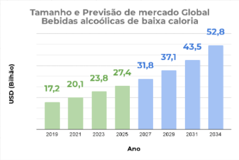
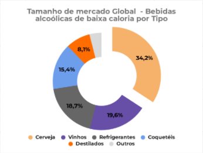

# Nome do case

Business Canvas — Ambev: Michelob Ultra

## 1. Apresentação do case

### 1.1. Histórico da marca e do negócio

Não desenvolvido

### 1.2. Produto ou serviço

Expandir as fronteiras da celebração social ao oferecer uma cerveja ultra leve e refrescante, de baixas calorias, e low carb, que destrava novas ocasiões de recompensa. É a escolha inteligente para adultos ativos que buscam o prazer de brindar suas conquistas sem o peso calórico, a letargia ou a quebra de ritmo da sua rotina de bem-estar.

### 1.3. Escopo do projeto

Proposta acadêmica para ampliar a preferência, a experimentação e a compra
de Michelob Ultra entre adultos ativos, articulando celebração social,
comunidades, ocasiões diurnas e acesso à compra.

## 2. Contexto de mercado

### 2.1. Cenário e tendências

**MUDANÇA COMPORTAMENTAL:** Mudança secular de hábitos; ascensão da tendencia de auto cuidado, bem estar e moderação no consumo alcóolico, sem abandonar a socialização.

### 2.2. Dados secundários e pesquisas publicadas

#### Estudo sobre uso moderado de cervejas após exercícios físicos

Ref: <https://g1.globo.com/ciencia-e-saude/noticia/2011/09/cerveja-e-tao-eficaz-quanto-agua-para-reidratar-apos-exercicio-diz-estudo.html>

##### O que o estudo defende (Pontos Positivos):

Hidratação equivalente: Uma dose moderada (cerca de 660 ml) consegue repor os líquidos do corpo com a mesma eficiência que a água logo após o exercício.

Benefícios extras: Substâncias presentes na cerveja, como os polifenóis, podem ajudar a proteger o coração e melhorar o colesterol, desde que a pessoa já tenha uma rotina saudável.

##### O contraponto (Riscos do Álcool):

Efeito reverso na hidratação: Como o álcool é diurético, passar da dose recomendada faz o corpo perder mais líquido do que ganha, causando desidratação.

##### Conclusão:

Uma dose controlada de cerveja não prejudica a hidratação imediata e pode ser consumida socialmente após o treino sem grandes danos. No entanto, a água e os isotônicos continuam sendo as opções mais seguras e recomendadas, pois entregam o resultado esperado sem os efeitos colaterais e os riscos associados ao álcool.

### 2.3. Oportunidade e potencial de mercado

#### Estudo de mercado realizado pela dataintelo

Ref: <https://dataintelo.com/report/low-calorie-alcoholic-beverages-market#:~:text=The%20global%20low%2Dcalorie%20alcoholic%20beverages%20market%20was,social%20norm%20rather%20than%20a%20niche%20preference.>

##### Tamanho e Previsão de mercado Global Bebidas alcoólicas de baixa caloria

| Ano | USD (Bilhão) |
| --- | --- |
| 2019 | 17,2 |
| 2021 | 20,1 |
| 2023 | 23,8 |
| 2025 | 27,4 |
| 2027 | 31,8 |
| 2029 | 37,1 |
| 2031 | 43,5 |
| 2034 | 52,8 |

##### Tamanho de mercado Global - Bebidas alcoólicas de baixa caloria por Tipo

| Tipo | Percentual exibido no gráfico |
| --- | --- |
| Cerveja | 34,2% |
| Vinhos | 19,6% |
| Refrigerantes | 18,7% |
| Coquetéis | 15,4% |
| Destilados | 8,1% |
| Outros | Não exibido |

## 3. Problema a ser resolvido

### 3.1. Definição do problema

**O DILEMA DA INDÚSTRIA:** Cervejas comuns pesam no corpo e geram culpa/letargia, enquanto as opções zero álcool encontram maior estigma e resistência à abstinência forçada, alem de afetar a percepcao de melhora de socializacao e relaxamento.

O problema proposto é ampliar a preferência, a experimentação e a compra de
Michelob Ultra pela associação da marca a ocasiões de celebração social de
adultos ativos. O Canvas prioriza Millennials (70%), seguido da Geração Z
(20%), com atuação residual para a Geração X (10%). Esses percentuais e os
perfis descritos na imagem orientam o planejamento e devem ser validados
por pesquisa; não representam resultados já demonstrados.

### 3.2. Entraves da marca

**Baixo Brand Awareness Qualificado:** O consumidor ainda não conhece o posicionamento ou confunde o produto com uma cerveja tradicional da prateleira.

**Estigma Sensorial Histórico:** Memória afetiva negativa de cervejas light (Aguadas), que exige ativações agressivas para provar sabor e corpo puro malte.

A proposta combina celebrações após atividades esportivas, encontros diurnos,
almoços de fim de semana e sunsets com presença no varejo e conveniência de
entrega. Ceticismo sobre sabor, conhecimento da marca, disponibilidade e
adequação a essas ocasiões são barreiras a investigar por segmento e canal.

### 3.3. Principais limitadores sob a perspectiva do marketing

**Resistência no Trade On-Trade (Inércia de Bares/Cardápios):** Dificuldade de convencer bares tradicionais a abrir torneiras ou espaço em geladeira para uma cerveja que foge da "cerveja trincando de volume noturno".

**Limitações Regulatórias e de Linguagem (CONAR / Anvisa):** Impossibilidade legal de usar palavras como "fitness", "saudável" ou associar diretamente o produto a atletas e performance física, exigindo narrativas indiretas de "equilíbrio" e "celebração consciente".

## 4. Análise da concorrência

### 4.1. Concorrente 1

#### Apresentação e principais qualidades

- Heineken 0.0: Líder em zero álcool (abstinência situacional / direção). Michelob vence por ter álcool real, evitando o sentimento de exclusão ou privação social.

#### Relação com o case

Não desenvolvido

#### Site e fontes

Não desenvolvido

### 4.2. Concorrente 2

#### Apresentação e principais qualidades

- Corona / Cervejas Lagers Leves: Vendem frescor diurno, mas mantêm 140+ kcal e carboidratos.

#### Relação com o case

Não desenvolvido

#### Site e fontes

Não desenvolvido

### 4.3. Concorrente 3 — opcional

#### Apresentação e principais qualidades

- Hard Seltzers (Mike's, etc.): Sem ritual da cerveja e com alta rejeição cultural no Brasil.

#### Relação com o case

Não desenvolvido

#### Site e fontes

Não desenvolvido

### 4.4. Heineken Ultimate — a extensão premium com menos calorias

#### Apresentação e principais qualidades

A Heineken Ultimate leva a disputa para dentro da própria marca Heineken. O portfólio brasileiro informa **97 kcal por garrafa de 330 ml, 3,5% de teor alcoólico e ausência de glúten**. A redução anunciada de 30% de calorias usa como referência a Heineken regular.

**A proposta:** permitir uma escolha com menos calorias dentro de uma marca conhecida.

Conteúdo publicado pela própria Heineken informa que o Brasil foi o primeiro mercado do lançamento, anunciado em maio de 2026, e apresenta o produto como ampliação das opções para diferentes ocasiões.

#### Relação com o case

**Como pressiona a Michelob:** a hipótese competitiva é a retenção de quem já prefere Heineken e passa a buscar redução calórica. Esse consumidor pode encontrar uma alternativa na marca habitual, reduzindo a necessidade de experimentar outra. A resposta da Michelob deve trabalhar identidade própria, sabor e experimentação, além da comparação numérica de caloria

#### Site e fontes

[Grupo HEINEKEN — portfólio brasileiro](https://www.heinekenbrasil.com.br/nossas-marcas)

[Heineken — conteúdo de marca no Valor Econômico](https://valor.globo.com/conteudo-de-marca/heineken/noticia/2026/07/14/heineken-lanca-versao-com-menor-teor-alcoolico-e-caloria-primeiro-no-brasil.ghtml)

### 4.5. Comparação entre concorrentes

#### ANÁLISE DE CONCORRÊNCIA · MICHELOB ULTRA

##### Calorias em uma base comparável

Cervejas com álcool · kcal por 100 ml · versões brasileiras pesquisadas

| | | kcal por 100 ml | PORÇÃO INFORMADA |
| --- | --- | --- | --- |
| Michelob Ultra | Ambev · foco do projeto | 25,8 | 85 kcal / 330 ml |
| Amstel Ultra | Grupo HEINEKEN | 26,2 | 72 kcal / 275 ml |
| Heineken Ultimate | Grupo HEINEKEN | 29,4 | 97 kcal / 330 ml |
| Stella Pure Gold | Ambev · alternativa interna | 33,9 | 112 kcal / 330 ml |

0 · 10 · 20 · 30 · 40

kcal por 100 ml

Fontes: material institucional Ambev (hospedado por terceiros), Heineken Express e Grupo HEINEKEN.

Cálculo: kcal da porção ÷ volume em ml × 100. Arredondamento para uma casa decimal.

Comparação de composição: não representa participação de mercado ou benefício à saúde.

Pesquisa: 09/09/2026 · Links e limitações das fontes em Concorrentes_cervejas_baixa_caloria.md.

A [análise de concorrência](Concorrentes_cervejas_baixa_caloria.md) deverá
apoiar a comparação da Michelob Ultra com Amstel Ultra, Heineken Ultimate e
Stella Pure Gold em atributos, preço, ocasiões e presença comercial. A
comparação de calorias deve usar volumes equivalentes. A diferenciação
proposta se concentra na experiência, nas comunidades e na integração entre
experimentação e compra.

## 5. Benchmarks

### 5.1. Marca inspiradora 1

#### Caso de referência

Não desenvolvido

#### Aprendizados aplicáveis ao projeto

Não desenvolvido

#### Site e fontes

Não desenvolvido

### 5.2. Marca inspiradora 2

#### Caso de referência

Não desenvolvido

#### Aprendizados aplicáveis ao projeto

Não desenvolvido

#### Site e fontes

Não desenvolvido

### 5.3. Marca inspiradora 3 — opcional

#### Caso de referência

Não desenvolvido

#### Aprendizados aplicáveis ao projeto

Não desenvolvido

#### Site e fontes

Não desenvolvido

## 6. Solução proposta

### 6.1. Objetivo do projeto

**A TESE DO CASE (LIDERAR A TRANSIÇÃO):** Posicionar a companhia como pioneira na transição de hábitos, criando e liderando a categoria Ultra Light Premium

### 6.2. Estratégia de marketing digital

**EXPANSÃO DE MOMENTOS:** Não é fugir da noite, mas ampliar o repertório: mantém a noite leve (sem sabotar o dia seguinte) e destrava novos momentos diurnos de recompensa ativa (pós-treino, linha de chegada, sunsets e almoços) onde a cerveja comum não cabia.

#### 1. ESTRATÉGIA CENTRAL DE SOLUÇÃO (SMART DRINKING / LIFESTYLE AMPLO)

Superar o estigma da "cerveja aguada" via degustação.

Evitar a armadilha do nicho esportivo: usar o esporte apenas como inspiração aspiracional (halo effect), ancorando o volume real no bem-estar cotidiano, almoços leves e noites sem culpa

### 6.3. Público-alvo e prioridades

#### CORE TARGET (70%) | MILLENNIALS (28-43 anos) — "The Balanced Strivers"

- Perfil: Adultos ativos com rotinas exigentes e desaceleração metabólica.
- Driver: Brinde premium sem culpa nem ressaca; preserva o treino e o foco do dia seguinte.
- Ocasiões: Pós-treino diurno (finish line), almoços de fim de semana e sunsets.
- Conversão: Alta aderência e baixo atrito (fit natural com rotina low carb).

#### ESTRATÉGICO (20%) | GERAÇÃO Z (18-27 anos) — "Mindful Socializers"

- Perfil: Adeptos de mindful drinking; prezam por autocontrole e bem-estar.
- Driver: Alternativa leve e estética; ritual social sem o peso das cervejas comuns.
- Ocasiões: Festivais diurnos, encontros casuais e pós-atividades esportivas.
- Conversão: CAC moderado; exige conexão autêntica via TikTok, Strava e creators.

#### RESIDUAL (10%) | GERAÇÃO X (44-59 anos) — "Habit Loyalists"

- Perfil: Hábitos consolidados em rótulos tradicionais; céticos quanto a cervejas "leves".
- Driver: Prescrição médica ou controle calórico/glicêmico pontual (não por estilo de vida).
- Conversão: CAC alto / baixo ROI em mídia de massa; foco apenas tático em gôndola (PDV).

### 6.4. Proposta de lançamento e delimitação do MVP

Planejar um piloto regional que conecte uma comunidade adulta de corrida ou
beach tennis, uma ocasião diurna de celebração e pontos de compra abastecidos.
O percurso integra divulgação por criadores e comunidades, experimentação
guiada, acesso à compra e acompanhamento de recompra.

O piloto deverá selecionar ações dos três eixos presentes na imagem:
experiência e novas ocasiões; conhecimento de marca e comunidades digitais;
e experimentação e conversão no ponto de venda. Desafios no Strava, conteúdo
em TikTok e Reels, degustação, exposição e cupons compõem alternativas a
avaliar conforme acesso aos parceiros, recursos e viabilidade.

Os canais do Canvas abrangem varejo de massa, bares e restaurantes, espaços
esportivos, food service diurno, entrega e eventos. O MVP selecionará um
conjunto limitado e integrado desses canais, permitindo avaliar o percurso
até a compra. O alcance nacional da estrutura de custos será distinguido
dos recursos necessários ao piloto regional.

Região, duração, parceiros, embalagens, preço, investimento e critérios de
participação serão definidos com base em evidências. A cerveja já existe;
a novidade proposta está na combinação local de ocasiões, relacionamento e
ativação comercial. O trabalho acadêmico entregará o desenho e a viabilidade
esperada; a execução dependeria da Ambev e dos parceiros.

### 6.5. Plano tático e etapas do projeto

#### 2. PLANO TÁTICO DE GTM (PASSO A PASSO DO PROJETO EM 4 FASES):

- **Onda 1 (Seed & Trial):** Degustação guiada em parques, almoços casuais e circuitos urbanos.
- **Onda 2 (Expansão de Trade):** Ponta de gôndola e geladeiras em grandes redes, empórios e bares.
- **Onda 3 (Ampliação de Repertório):** Campanhas de "Sunset Hour" e "Semana Consciente" no Zé.
- **Onda 4 (Comunidade & Retenção):** Desafios Strava + réguas de CRM para momentos de autocuidado.

### 6.6. Mídias, plataformas e públicos

#### 4. MATRIZ DE MÍDIAS & PLATAFORMAS POR PÚBLICO:

- Millennials (70%): Instagram, Strava, Podcasts de Negócios/Estilo de Vida e CRM no Zé Delivery.
- Gen Z (20%): TikTok (desmistificando o produto com estética e humor) e festivais diurnos.
- Gen X (10%): Ponta de gôndola no PDV físico, empórios e OOH próximo a centros empresariais.

### 6.7. Dados e aprendizados que sustentam a solução

#### 3. DADOS DE APRENDIZADO & CURIOSIDADES:

- 80% dos consumidores de opções leves/zero continuam bebendo cervejas tradicionais (repertório).
- Michelob é a 2ª cerveja mais vendida nos EUA pelo apelo de equilíbrio ("It's Only Worth It...").
- A fermentação estendida converte todo o amido residual sem reduzir o teor alcoólico regular.

As afirmações dos blocos transcritos são preservadas como conteúdo da imagem.
A pesquisa deverá verificar os atributos do produto e as premissas de
comportamento antes de convertê-los em mensagens de campanha, inclusive as
formulações sobre ressaca, treino, bem-estar e prescrição médica.

- Público: validar os perfis, as faixas etárias e a priorização 70%/20%/10% da imagem, investigando hábitos, ocasiões, percepção de leveza e disposição para experimentar entre adultos que consomem cerveja com álcool.
- Produto e concorrência: verificar calorias, carboidratos, composição, processo produtivo e demais atributos mencionados; comparar volumes equivalentes, preços, experiências e canais concorrentes.
- Comunicação e comunidades: avaliar identificação com celebração, conteúdo de criadores, TikTok, Reels e Strava; distinguir intenção declarada, participação em desafios, resgate de incentivos e compra efetiva.
- Oferta e canais: levantar disponibilidade, exposição, temperatura de serviço e capacidade de reposição em varejo, food service, espaços esportivos, eventos e entrega; selecionar as conexões mais viáveis para o piloto.
- Recursos e parceiros: verificar condições de acesso a organizadores, assessorias, influenciadores, geladeiras, equipes, BEES, Strava e plataformas de entrega; não pressupor integrações ou acordos já existentes.
- Viabilidade: documentar produção, matérias-primas, fornecedores, pessoal, desenvolvimento, marketing, patrocínios, logística e impostos; distinguir custos da operação da marca e custos atribuíveis ao piloto, evitando dupla contagem.

## 7. Business Canvas

### 7.1. Parceiros-chave

- **1. TRADE & VAREJO (Escala e Abastecimento):** Redes de supermercados, atacarejos e distribuidores locais para garantir capilaridade de estoque, geladeiras exclusivas e gôndola.
- **2. FOOD SERVICE:** Bares casuais, restaurantes diurnos (brunch/poke) e arenas de beach tennis para inserção no menu e geração de consumo social imediato.
- **3. ECOSSISTEMA ESPORTIVO & EVENTOS:** Organizadores de eventos de corrida (ex: Iguana, Yescom), assessorias esportivas, circuitos de beach tennis (finish line trial), Influencers fitness.
- **4. PLATAFORMAS & TECNOLOGIA:** Strava (desafios proprietários gamificados) e apps de entrega (Zé Delivery/iFood) para ativações promocionais contextuais de alta conversão.
- **5. Influenciadores:** Atletas amadores, corredores urbanos e produtores de conteúdo de gastronomia/equilíbrio/ Life Style

### 7.2. Atividades-chave

#### 1. EXPERIÊNCIA & OCCASION UNLOCKING (Finish Line & Dayparting) — Foco: Millennials (70%)

- Patrocínio e Presença Oficial na Linha de Chegada de Circuitos de Corrida / Meias-Maratonas.
- Parcerias B2B com Assessorias Esportivas, Clubes de Beach Tennis e Torneios Diurnos.
- Criação de "Michelob Sunset Hours": ativação em rooftops e beach clubs aos sábados/domingos.

#### 2. BRAND AWARENESS DIGITAL & COMUNIDADES — Foco: Gen Z (20%) + Millennials Jovens

- Desafios Oficiais no Strava (ex: "Clube Michelob Ultra" — desbloqueio de brindes/descontos).
- Squad de Influenciadores de Lifestyle Híbrido (runners, praticantes de yoga, chefs funcionais).
- Conteúdo Nativo em TikTok & Reels focado em desmistificar cerveja leve (sem tabu e sem peso).

#### 3. TRADE MARKETING, TRIAL & CONVERSÃO EM GÔNDOLA — Foco: Conversão Ampla + Gen X (10%)

- Geladeiras Proprietárias e Displays Especiais próximos a seções saudáveis e hortifrúti no PDV.
- Sampling Guiado em pontos estratégicos (parques urbanos, eventos esportivos e empórios).
- Packs Promocionais de Degustação cruzados com momentos de churrasco leve e finais de semana.

### 7.3. Recursos-chave

- **1. FÍSICOS & LOGÍSTICOS:** Cervejarias com tecnologia de fermentação estendida (baixo carboidrato sem perder corpo) + Frota refrigerada e geladeiras proprietárias instaladas no Trade/PDV.
- **2. PROPRIEDADE INTELECTUAL & MARCA:** Fórmula patenteada Ultra Light (baixa caloria, low carb e puro malte) + Brand Equity global consolidado no território de Active Lifestyle e patrocínios esportivos.
- **3. DADOS, CRM & TECNOLOGIA:** Integração de dados de consumo (BEES / Zé Delivery) + Comunidade conectada via Strava Club para réguas de ativação contextual e mensuração de ROI.
- **4. TALENTOS & Rede de influenciadores:** Equipe especializada em Trade Marketing Esportivo/Lifestyle + Rede de embaixadores e atletas amadores atuando como porta-vozes orgânicos da marca.

### 7.4. Proposta de valor

Expandir as fronteiras da celebração social ao oferecer uma cerveja ultra leve e refrescante, de baixas calorias, e low carb, que destrava novas ocasiões de recompensa. É a escolha inteligente para adultos ativos que buscam o prazer de brindar suas conquistas sem o peso calórico, a letargia ou a quebra de ritmo da sua rotina de bem-estar.

### 7.5. Relacionamento com clientes

- **1. EXPERIÊNCIA NO PDV:** Cmerchandising em seções saudáveis + degustação gelado guiado (quebra de ceticismo do sabor) + QR Code na garrafa para desafios Strava e apps parceiros.
- **2. GAMIFICAÇÃO & "EARNED CELEBRATION":** Km rodados no Strava liberam cupons no PDV e acessos VIP — ressignificando o consumo como conquista merecida pelo esforço do treino.
- **3. COMMUNITY-LED GROWTH:** Presença em assessorias de corrida e arenas de beach tennis ("Run Now, Ultra Later"), fortalecendo o senso de tribo e status de atleta amador.
- **4. COMUNICAÇÃO DIRETA COM PUBLICO ALVO:** Comunicação leve de apoio ao equilíbrio (sem tabus ou culpas), participação em Podcasts de saude, bate papo com influenciadores, bate papo em eventos de saude, nutrição e atividades físicas

### 7.6. Canais

#### A. Canais Tradicionais de Massa (A Base de Volume & Escala)

- **Grandes Redes e Atacarejos:** Presença obrigatória no grande varejo alimentar (Carrefour, Pão de Açúcar, Assaí, Atacadão) para viabilizar volume e presença na lista de compras regular. Packs maiores (12 a 24 latas) focados no consumo do churrasco leve e finais de semana.
- **Bares e Restaurantes Tradicionais:** Entrada no On-Trade tradicional com o apelo de ser a cerveja que "não empanturra", ideal para o almoço de domingo com a família ou para quem quer estender a permanência na mesa sem sentir estufamento.

#### B. Canais Lifestyle & Diurnos (Construção de Prestígio e Novas Ocasiões)

- **Arenas Esportivas e Clubes:** Arenas de Beach Tennis, complexos de pickleball, clubes de golfe/tênis e marinas, posicionando Michelob como a bebida oficial de descompressão pós-partida.
- **Food Service Saudável / Diurno:** Poke bars, cafés contemporâneos, brunch spots e quiosques de praia, ofertando uma alternativa alcoólica onde antes só se consumia água de coco, refrigerante zero ou suco.

#### C. Quick Commerce & D2C (Momento Certo & Conveniência Imediata)

- **Ecossistema Zé Delivery / iFood:** Campanhas com push geolocalizado ativadas em janelas estratégicas de calor e fins de semana (11h às 16h), garantindo que a cerveja chegue gelada na residência do consumidor logo após atividades físicas ou no almoço.

#### D. Canais Não-Convencionais & Eventos (Trial de Alto Impacto)

- **Presença física na linha de chegada de grandes provas de corrida amadora e maratonas:** promovendo a primeira lata como símbolo de celebração de esforço concluído.

### 7.7. Segmentação de clientes

#### CORE TARGET (70%) | MILLENNIALS (28-43 anos) — "The Balanced Strivers"

- Perfil: Adultos ativos com rotinas exigentes e desaceleração metabólica.
- Driver: Brinde premium sem culpa nem ressaca; preserva o treino e o foco do dia seguinte.
- Ocasiões: Pós-treino diurno (finish line), almoços de fim de semana e sunsets.
- Conversão: Alta aderência e baixo atrito (fit natural com rotina low carb).

#### ESTRATÉGICO (20%) | GERAÇÃO Z (18-27 anos) — "Mindful Socializers"

- Perfil: Adeptos de mindful drinking; prezam por autocontrole e bem-estar.
- Driver: Alternativa leve e estética; ritual social sem o peso das cervejas comuns.
- Ocasiões: Festivais diurnos, encontros casuais e pós-atividades esportivas.
- Conversão: CAC moderado; exige conexão autêntica via TikTok, Strava e creators.

#### RESIDUAL (10%) | GERAÇÃO X (44-59 anos) — "Habit Loyalists"

- Perfil: Hábitos consolidados em rótulos tradicionais; céticos quanto a cervejas "leves".
- Driver: Prescrição médica ou controle calórico/glicêmico pontual (não por estilo de vida).
- Conversão: CAC alto / baixo ROI em mídia de massa; foco apenas tático em gôndola (PDV).

### 7.8. Estrutura de custos

- Custos de produção e matérias-primas.
- Custos com Fornecedores e Folha de pagamento
- Desenvolvimento e evolução do produto
- Investimentos em marketing, publicidade e patrocínios
- Custos logísticos de distribuição nacional.
- Impostos sobre bebidas alcoólicas.

### 7.9. Fontes de receita

- Venda de Michelob Ultra
- Aumento da frequência de compra
- Aquisição de novos consumidores
- Incremento de vendas em novas ocasiões de consumo

## 8. Resultados pretendidos

### 8.1. Benefícios e conquistas esperados

Não desenvolvido

### 8.2. Indicadores e metas

- Conhecimento e identificação: estimar reconhecimento da marca, compreensão da proposta e associação às ocasiões descritas, por segmento prioritário.
- Comunidades e relacionamento: propor acompanhamento de adesão a desafios, interação com conteúdo, uso de QR Code e resgate de cupons, vinculando esses indicadores à compra quando houver dados disponíveis.
- Disponibilidade e experiência: acompanhar estoque, rupturas, exposição e condições de degustação nos pontos selecionados.
- Experimentação e conversão: prever registro de participantes únicos, primeiras compras e conversão por canal e ocasião, com janela de atribuição definida e sem duplicar consumidores.
- Frequência e novas ocasiões: estimar recompra e investigar se as vendas representam novas ocasiões ou substituição de compras que já ocorreriam.
- Eficiência por segmento: estimar CAC e retorno por público e canal para avaliar a priorização 70%/20%/10% e o foco tático em PDV para a Geração X.
- Resultado econômico: projetar receita líquida incremental, custos variáveis e investimento atribuível à ação, descontando efeitos de substituição de outras marcas da Ambev.

As metas numéricas serão definidas após o levantamento da linha de base.
O avanço dependerá da validação do público e das ocasiões, da disponibilidade
de parceiros e produto e da viabilidade econômica nas premissas adotadas.

### 8.3. Dados, premissas e raciocínio das projeções

As receitas serão projetadas a partir da venda de Michelob Ultra. Frequência
de compra, aquisição de consumidores e novas ocasiões serão tratadas como
fatores de crescimento dessa venda, sem contabilizar a mesma receita mais de
uma vez. Os cenários conservador, central e favorável deverão explicitar a
origem e a sensibilidade das premissas.

### 8.4. Forma de avaliação dos resultados

Uma execução futura poderia comparar pontos participantes e pontos
semelhantes sem a ação, considerando períodos anteriores e posteriores,
preço, promoções, clima, calendário de eventos e sazonalidade. No trabalho
acadêmico, serão apresentados o método, as evidências, os cenários e os
critérios de decisão.

### 8.5. Resultados adicionais e feedback do cliente — se houver

Não desenvolvido

## 9. Referências

Ref: <https://dataintelo.com/report/low-calorie-alcoholic-beverages-market#:~:text=The%20global%20low%2Dcalorie%20alcoholic%20beverages%20market%20was,social%20norm%20rather%20than%20a%20niche%20preference.>

Ref: <https://g1.globo.com/ciencia-e-saude/noticia/2011/09/cerveja-e-tao-eficaz-quanto-agua-para-reidratar-apos-exercicio-diz-estudo.html>

[Grupo HEINEKEN — portfólio brasileiro](https://www.heinekenbrasil.com.br/nossas-marcas)

[Heineken — conteúdo de marca no Valor Econômico](https://valor.globo.com/conteudo-de-marca/heineken/noticia/2026/07/14/heineken-lanca-versao-com-menor-teor-alcoolico-e-caloria-primeiro-no-brasil.ghtml)

## 10. Apêndices e anexos

### 10.1. IAs utilizadas

Não desenvolvido

### 10.2. Prompts principais

Não desenvolvido

### 10.3. Aprendizados com o uso de IA

Não desenvolvido

### 10.4. Dados, gráficos e materiais de apoio

Modelo de referência: [BusinessCanvasRevisto-v2.png](BusinessCanvasRevisto-v2.png).
Modelo de formatação: [BusinessCanvas_MichelobUltra.md](BusinessCanvas_MichelobUltra.md).

Os nove blocos do Canvas abaixo transcrevem o conteúdo da imagem, mantendo
sua redação e seus itens. As seções complementares foram revisadas para
coerência com esse conteúdo e representam hipóteses de planejamento acadêmico,
sem execução na empresa. Versão de 12/09/2026.

#### Apêndice — Gráficos recortados da imagem original

##### Gráfico 1 — Tamanho e Previsão de mercado Global Bebidas alcoólicas de baixa caloria

[Arquivo do gráfico 1](EstudoMercado16092_Grafico_Previsao.png)

##### Gráfico 2 — Tamanho de mercado Global - Bebidas alcoólicas de baixa caloria por Tipo

[Arquivo do gráfico 2](EstudoMercado16092_Grafico_Tipos.png)
